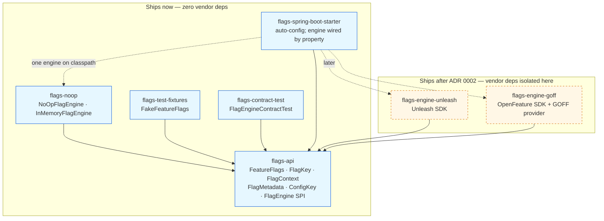
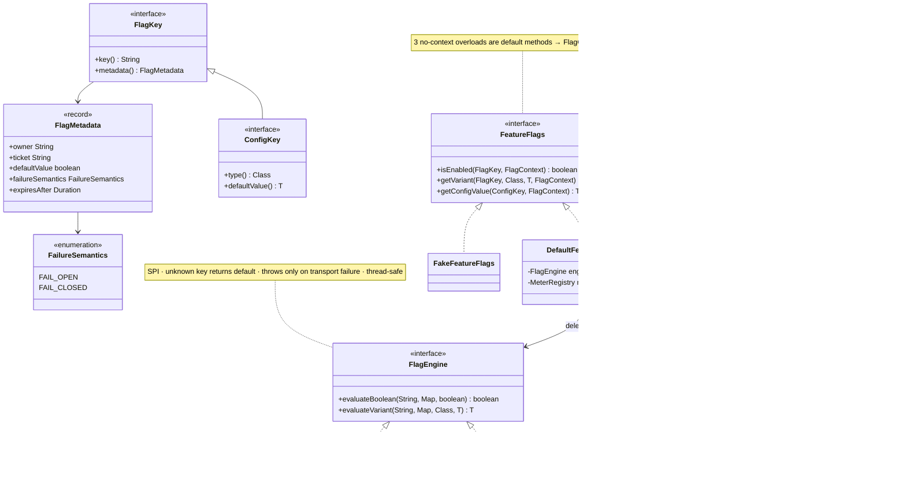
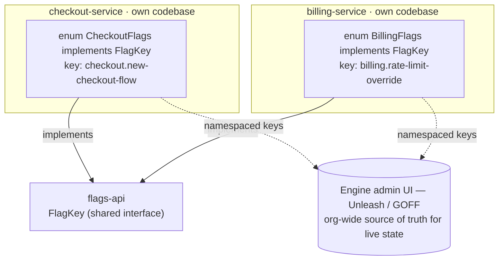
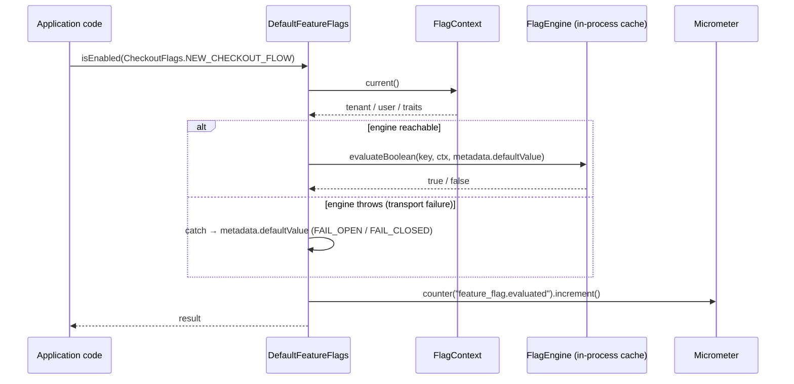
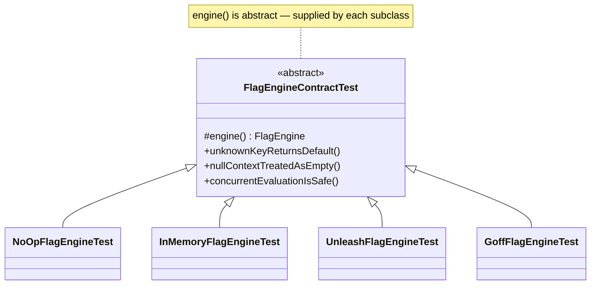
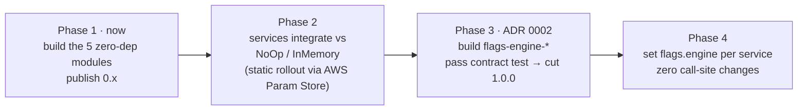
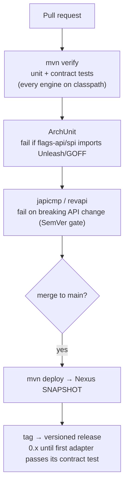

# In-House Facade — Design (Diagram-Forward Draft)

Draft companion to `feature-flags-facade-design.md` — same design, expressed as diagrams. Full prose, versioning rationale, and contract wording live there. ADR 0002's proposed evolutions (governance automation, interaction scan, resilience contract) are **not** folded in here yet. Package placeholder: `com.acme.flags`.

---

## Principles

1. Consume engine state — never own a second copy.
2. Engine-agnostic at compile time — vendor SDKs live only in adapter modules.
3. Decentralized registries — no org-wide enum.
4. Additive evolution — a breaking public-API change is fleet-wide.

---

## Module layout

*All modules depend only on `flags-api`; vendor SDKs never reach it. An ArchUnit test fails the build if `flags-api`/`flags-spi` imports an Unleash or GOFF package.*

*Update: `flags-engine-goff`'s module shell already shipped on `main` as an inert pre-ratification skeleton — see `feature-flags-facade-design.md`'s module-layout section for the detail. "Ships after ADR 0002" here means the functioning adapter, not the module's existence.*

---

## Core interfaces

*`defaultValue` (what is returned on failure) is split from `failureSemantics` (the human-readable label lint validates against it). `FeatureFlags` has only 3 abstract methods; everything else is a default method — that keeps additive evolution a MINOR bump.*

---

## Registries — per-service, not a global enum

*Each service owns its registry (no cross-team merge hotspot, no fleet redeploy to add a flag). The enums are typed handles into the engine's own catalog — not a competing catalog.*

---

## Evaluation + centralized failure policy

*The engine evaluates from its in-process cache — no network hop on the hot path. Fallback-to-default lives in one place, applied identically fleet-wide, per each flag's declared semantics.*

---

## Testing — one contract, every engine

*Ship-now engines (NoOp, InMemory) pass it today; vendor adapters extend the same base after ADR 0002 — holding every engine to one bar without `flags-api` touching any SDK. `FakeFeatureFlags` is the separate double for facade **consumers**.*

---

## Rollout — doesn't wait on the engine choice

*Typed API, governance metadata, and consistent failure behavior land in every service now; the engine decision becomes a config change layered on top — the same swap mechanic as engine-A→engine-B, run in the direction no-engine→an-engine.*

---

## CI gates

---

## Versioning (blast radius: every service)

| Change | Bump |
|---|---|
| New default method on `FeatureFlags` | MINOR |
| Change an abstract signature on `FeatureFlags` / `FlagEngine` | MAJOR — avoid |
| New non-default method on `FlagEngine` | MAJOR — prefer a default instead |
| Service adds a `FlagKey` to its own registry | n/a — service-owned |

---

## Tech stack

| Concern | Choice |
|---|---|
| Build | Maven multi-module reactor + `flags-bom` |
| CI/CD | GitHub Actions |
| Artifacts | Self-hosted Nexus |
| JDK | Java 21 (LTS) |
| Test | JUnit 5 (Jupiter) + AssertJ |
| Metrics | Micrometer (CloudWatch registry) |
| Logging | SLF4J API only — consumer supplies the binding |

---

## References

- `feature-flags-facade-design.md` — canonical prose spec this mirrors
- `../adr/0001-adopt-in-house-facade-alongside-flag-engine.md`, `../adr/0002-select-flag-engine-and-evolve-facade-operating-model.md`
- `feature-flags-facade-sketch.md`, `feature-flags-comparison.md`, `feature-flags-use-cases.md`
