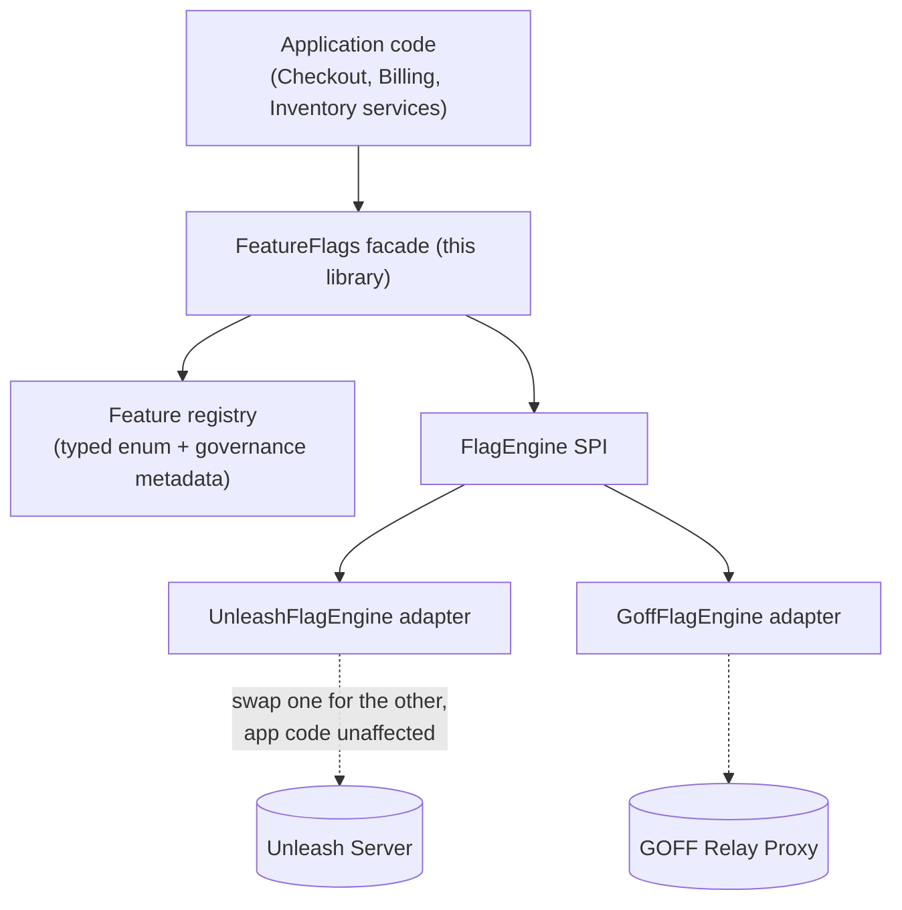

# In-House Facade — API Surface Sketch

Sketch of the "alongside" thin layer from `feature-flags-comparison.md`'s final shortlist. The facade is engine-agnostic by design — `FlagEngine` is a small internal SPI, so the same facade works whether the underlying engine is Unleash or GOFF, and swapping one for the other (or adding a second as fallback) never touches application call sites.

## Layering



---

## 1. Public API — what application code actually calls

```java
public interface FeatureFlags {
    boolean isEnabled(Feature feature);
    boolean isEnabled(Feature feature, FlagContext context);
    <T> T getVariant(Feature feature, Class<T> type, T defaultValue);
    <T> T getConfigValue(ConfigKey<T> key, T defaultValue);
}
```

```java
@Service
class CheckoutService {
    private final FeatureFlags flags;

    void handleCheckout(Order order) {
        if (flags.isEnabled(Feature.NEW_CHECKOUT_FLOW, FlagContext.forTenant(order.tenantId()))) {
            newCheckoutFlow(order);
        } else {
            legacyCheckoutFlow(order);
        }
    }
}
```

No string flag names, no vendor SDK import, no manual context-building at the call site.

---

## 2. Feature registry — typed flags with governance baked in

```java
public enum Feature implements FlagKey {

    NEW_CHECKOUT_FLOW(FlagMetadata.builder()
        .owner("checkout-team")
        .ticket("CHECKOUT-1421")
        .failurePolicy(FailurePolicy.FAIL_CLOSED)   // safe default: old flow
        .expiresAfter(Duration.ofDays(90))
        .build()),

    BILLING_RATE_LIMIT_OVERRIDE(FlagMetadata.builder()
        .owner("billing-team")
        .ticket("BILL-88")
        .failurePolicy(FailurePolicy.FAIL_OPEN)     // safe default: standard limits apply
        .expiresAfter(null)                          // config, not a rollout — permanent
        .build()),

    SHIPPING_API_KILL_SWITCH(FlagMetadata.builder()
        .owner("platform-team")
        .ticket("INC-204")
        .failurePolicy(FailurePolicy.FAIL_OPEN)     // if unreachable, assume shipping API is fine
        .expiresAfter(null)
        .build());

    private final FlagMetadata metadata;
    Feature(FlagMetadata metadata) { this.metadata = metadata; }

    @Override public String key() { return name().toLowerCase().replace('_', '-'); }
    @Override public FlagMetadata metadata() { return metadata; }
}
```

A typo in a flag name is now a compiler error, not a silent no-op discovered at 2am.

---

## 3. Context resolution — auto-injected, not hand-built at every call site

```java
public class FlagContext {
    private final String tenantId;
    private final String userId;
    private final Map<String, String> traits;

    public static FlagContext current() {
        var tenant = TenantContext.get();                              // request-scoped bean
        var auth = SecurityContextHolder.getContext().getAuthentication();
        return new FlagContext(tenant.id(), auth.getName(), tenant.planTraits());
    }

    public static FlagContext forTenant(String tenantId) { ... }
}
```

`isEnabled(feature)` with no explicit context resolves `FlagContext.current()` automatically — most call sites never build a context by hand, and tenant/plan traits are pulled from the entitlements data you already have instead of being re-declared as segments in the vendor UI.

---

## 4. Engine SPI — the only place that knows Unleash or GOFF exists

```java
interface FlagEngine {
    boolean evaluateBoolean(String key, Map<String, String> context, boolean defaultValue);
    <T> T evaluateVariant(String key, Map<String, String> context, Class<T> type, T defaultValue);
}

@Component
@ConditionalOnProperty(name = "flags.engine", havingValue = "unleash")
class UnleashFlagEngine implements FlagEngine {
    private final Unleash unleashClient;

    public boolean evaluateBoolean(String key, Map<String, String> context, boolean defaultValue) {
        return unleashClient.isEnabled(key, toUnleashContext(context), defaultValue);
    }
    // ...
}

@Component
@ConditionalOnProperty(name = "flags.engine", havingValue = "goff")
class GoffFlagEngine implements FlagEngine {
    private final Client openFeatureClient;

    public boolean evaluateBoolean(String key, Map<String, String> context, boolean defaultValue) {
        return openFeatureClient.getBooleanValue(key, defaultValue, toEvaluationContext(context));
    }
    // ...
}
```

Swapping Unleash for GOFF — or adding a second engine as a fallback — is a config flip plus one adapter class. Zero changes to `CheckoutService` or any other caller.

---

## 5. Failure policy — enforced centrally, not decided ad hoc per team

```java
@Component
class DefaultFeatureFlags implements FeatureFlags {
    private final FlagEngine engine;
    private final MeterRegistry metrics;

    public boolean isEnabled(Feature feature, FlagContext context) {
        boolean result;
        try {
            result = engine.evaluateBoolean(
                feature.key(), context.toMap(), feature.metadata().failurePolicy().defaultValue());
        } catch (Exception e) {
            result = feature.metadata().failurePolicy().defaultValue();
            log.warn("Flag engine unavailable, falling back to policy default for {}", feature.key(), e);
        }
        metrics.counter("feature_flag.evaluated",
            "flag", feature.key(), "result", String.valueOf(result)).increment();
        return result;
    }
}
```

This is the piece that answers "what happens if the backend is unavailable" consistently, flag by flag, instead of leaving it to whichever engineer wrote a given call site — directly closing the gap flagged in `feature-flags-use-cases.md`.

---

## 6. Test double — no vendor SDK mocking required

```java
public class FakeFeatureFlags implements FeatureFlags {
    private final Map<Feature, Object> overrides = new HashMap<>();

    public void set(Feature feature, boolean value) { overrides.put(feature, value); }

    public boolean isEnabled(Feature feature, FlagContext ctx) {
        return (boolean) overrides.getOrDefault(feature, feature.metadata().failurePolicy().defaultValue());
    }
    // ...
}
```

```java
@Test
void newCheckoutFlow_runsWhenFlagEnabled() {
    fakeFlags.set(Feature.NEW_CHECKOUT_FLOW, true);
    // ...
}
```

---

## 7. Governance job — using data the vendor UI doesn't have

```java
@Scheduled(cron = "0 0 6 * * MON")
void reportStaleFlags() {
    for (Feature f : Feature.values()) {
        if (f.metadata().expiresAfter() != null && auditLog.lastEvaluated(f).isBefore(deadline(f))) {
            slackNotifier.notify(f.metadata().owner(), "Flag %s is stale — remove or renew".formatted(f.key()));
        }
    }
}
```

---

## What deliberately stays out of the facade

Rollout-percentage math, consistent-hashing bucketing, the admin UI, audit storage, and environment promotion all stay in Unleash/GOFF — the facade never reimplements them. Its job is exactly the customization list from the earlier "benefit of in-house thin layer" discussion (typed API, context injection, centralized fallback policy, vendor abstraction, governance, test ergonomics) and nothing more.

---

## Guardrails — staying "alongside," not sliding into "alone"

The core rule: **the facade may consume the engine's state, but must never become a second owner of it.** The moment it owns state — its own copy of "what value is this flag right now," computed or stored independently of asking Unleash/GOFF — it has stopped wrapping the engine and started duplicating it. This never happens as one decision; it happens as a sequence of individually-reasonable ones.

### How the creep actually happens

- **Storage creep.** Someone adds a local table "just as a resilience cache in case the engine is unreachable." Reasonable alone. Then someone adds a way for ops to edit that table directly during an incident, because waiting on the vendor UI mid-outage is annoying. Now flag state lives in two places with no defined rule for which one wins when they disagree.
- **Rollout-logic creep.** The vendor's targeting doesn't quite cover one use case (e.g. a rollout keyed on a composite of tenant + region the UI can't express). Someone writes the bucketing math inside the facade "just for this one flag." Two independent rollout engines now exist in the codebase, and nothing stops the next flag from also using the homegrown one.
- **Control-plane creep.** An internal admin page gets built inside the facade for toggling flags — motivated by SSO friction with the vendor UI, or wanting one unified ops dashboard. This duplicates the admin plane: two places someone can flip a flag, and the facade has quietly become authoritative for writes, not just reads.
- **Workflow creep.** A compliance requirement appears — flag changes need approval before going live. That's an Unleash Enterprise feature, paywalled. Building it in the facade means reimplementing an approval state machine, notification wiring, and an audit trail — exactly the kind of thing that was supposed to be someone else's problem.

### The test for where the line is

Read-only consumption — metrics on evaluation results, a governance job reading audit history, typed wrappers, context injection, a fallback default when the engine call throws — never creates a second source of truth: if the facade vanished tomorrow, the engine's own state would still be fully correct and complete. Anything that fails that test (the engine's state would be *incomplete* without also consulting the facade) is the tripwire.

This is the same distinction that separates the "12/15, alongside" score from the "1/15 setup, alone/full-parity" score in the ranking table: the low score wasn't about writing code, it was about taking on an open-ended distributed-systems problem — state consistency, propagation, HA — that Unleash/GOFF already solved, and re-solving it under less scrutiny and less battle-testing.

### Practical guardrails

- Keep `FlagEngine` narrow — `evaluateBoolean`/`evaluateVariant` and nothing else. A PR that adds a write path, or a new field to persisted facade state, is the signal to stop and ask why the vendor can't do it before adding it.
- Treat "we need X and the OSS tool doesn't have it" as a fork: either it's cheap read-only tooling (governance job, metrics) — fine, keep it in the facade — or it's genuinely a control-plane feature (approval workflows, a second admin UI, custom rollout math) — in which case the real options are paying for the vendor's Enterprise tier or accepting the gap, not quietly rebuilding it.
- Any cache in the facade should mirror what the SDK already does internally (read-through, poll-refreshed) — never an independently-writable store ops can edit directly.
