# Feature Flag Tooling — Use Cases & Runtime Impact

Companion to `feature-flags-comparison.md`. For each of the five shortlisted tools, plus the in-house facade pattern from the final shortlist, this document gives:

- A **runtime & dependency diagram** — what components exist, how they talk to each other, and where the flag data lives.
- **Three concrete use cases**, each with a sequence diagram showing the call path at request time, plus notes on complexity, dependencies, and what happens in production if the flag backend becomes unavailable.

> Diagram legend: solid arrows are synchronous/blocking calls; dotted or "optional" labels are best-effort/async paths. Notes on sequence diagrams call out the failure-mode behavior explicitly, since that's the detail that matters most once this is running in production.

---

## Unleash

### Runtime & Dependency Architecture

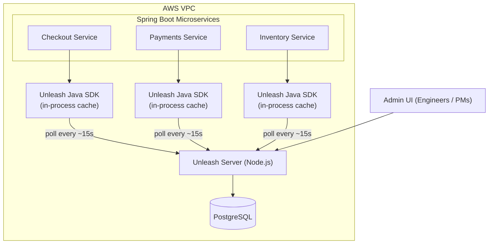

**Complexity:** Medium — one extra stateful service (Node.js + Postgres) to deploy and keep highly available, but the SDK-side story is simple.

---

### Use Case 1 — Canary rollout of a rewritten checkout service

Roll a new checkout implementation out by percentage of traffic (5% → 25% → 100%) using consistent user-ID hashing, with instant rollback via the UI if error rates spike.

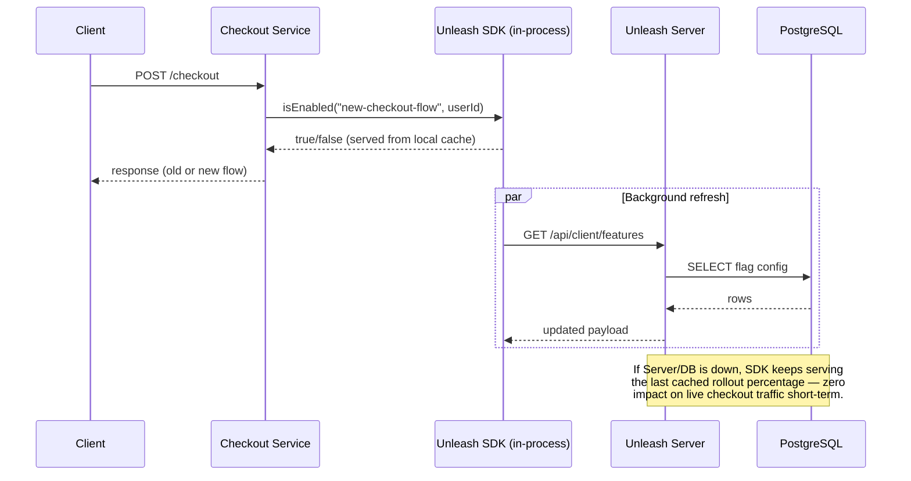

- **Complexity:** Medium — requires defining a gradual-rollout strategy with a stickiness field (user ID).
- **Dependencies:** Unleash Server, PostgreSQL, one background polling connection per service instance.
- **Production impact if backend is unavailable:** Low. The traffic split freezes at the last fetched value; nothing fails open or closed unexpectedly.

---

### Use Case 2 — Kill-switch for a flaky downstream dependency

Wrap calls to a fragile third-party shipping-rate API behind a boolean flag. When the API misbehaves, an on-call engineer flips `shipping-api-enabled` off in the Unleash UI to fall back to a cached rate table across every `order-service` instance within one poll interval.

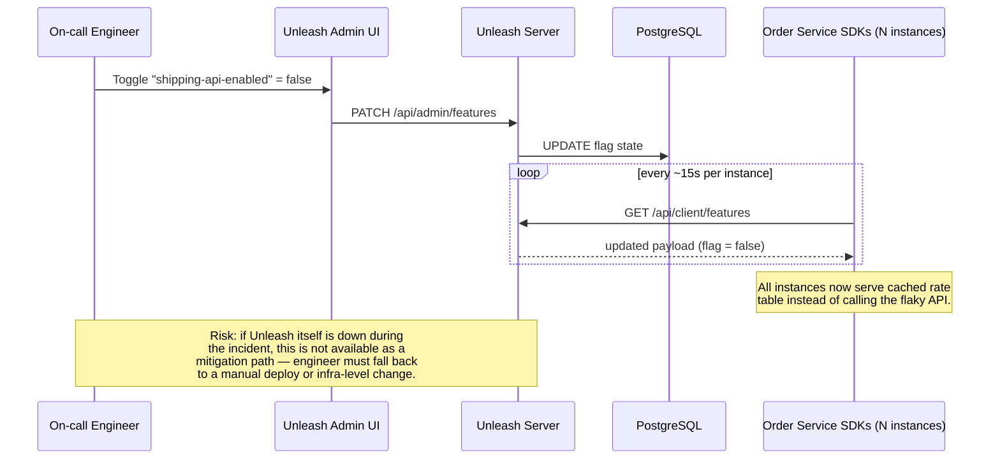

- **Complexity:** Low — single boolean, no targeting rules.
- **Dependencies:** Unleash Server/DB for the toggle to propagate; propagation delay is bounded by each instance's poll interval.
- **Production impact if backend is unavailable:** Medium — this *is* an incident-response tool, so an Unleash outage during an incident removes your fastest lever.

---

### Use Case 3 — Environment-scoped promotion (dev → staging → prod)

A new fraud-detection rule is enabled in `dev`, validated in `staging` by QA, then promoted to `prod` for 100% of traffic — no redeploy, just a state change per environment.

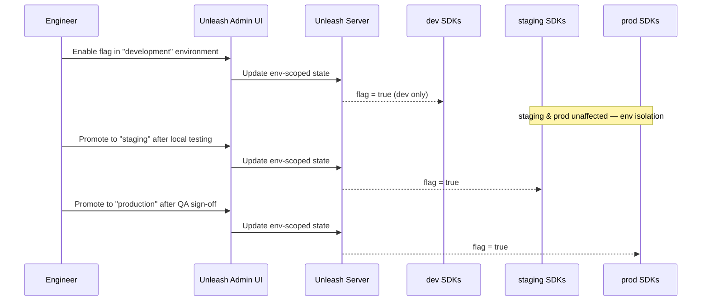

- **Complexity:** Medium-High — requires per-environment API keys/SDK configuration and a promotion discipline (manual or CI-driven).
- **Dependencies:** Unleash Server, PostgreSQL, correctly scoped SDK client keys per environment.
- **Production impact if backend is unavailable:** Low for already-promoted state (cached); the *promotion workflow itself* simply blocks until the server is back.

---

## Flagsmith

### Runtime & Dependency Architecture

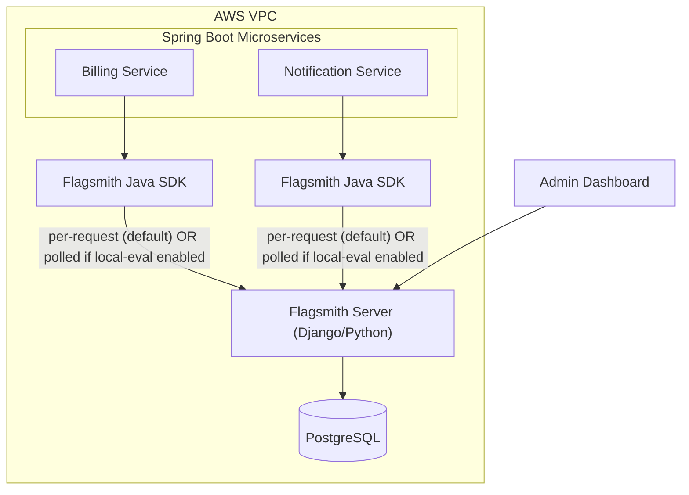

**Complexity:** Medium, with one important gotcha: the *default* server-SDK behavior is remote evaluation (a network call per flag check), not local caching — that has to be explicitly switched on.

---

### Use Case 1 — Per-tenant remote configuration in a multi-tenant SaaS

Each customer account has different plan-based limits (API rate limit, storage quota) stored as remote-config values, evaluated by identity/trait targeting rather than a single global flag.

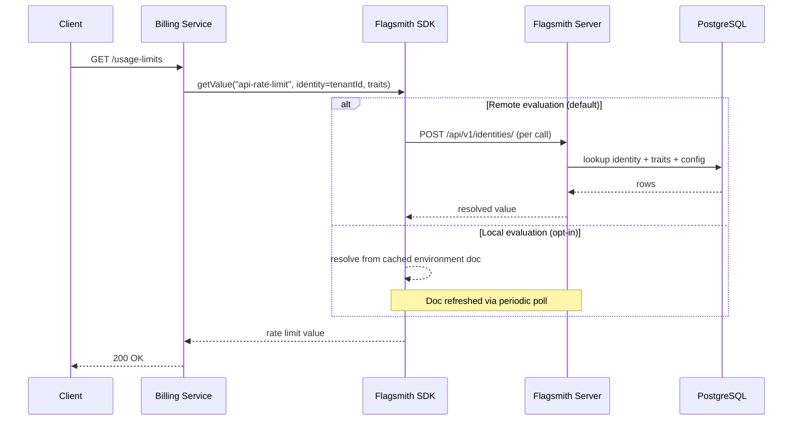

- **Complexity:** Medium — identity + trait-based segmentation per tenant.
- **Dependencies:** Flagsmith Server, PostgreSQL, tenant trait data passed at evaluation time.
- **Production impact if backend is unavailable:** **High in the default (remote-eval) mode** — every flag check is a live call, so an outage can degrade or fail limit lookups on the request path. Switching the SDK to local-evaluation mode changes this to Low, same as Unleash's caching model.

---

### Use Case 2 — Beta feature rollout to a customer segment

A new analytics dashboard is enabled only for accounts on the "Enterprise" plan, or explicitly whitelisted beta accounts, using Flagsmith's segment/identity targeting.

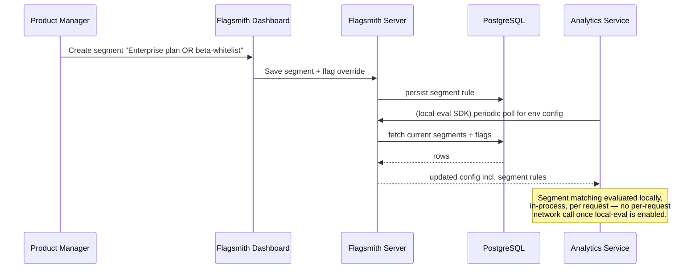

- **Complexity:** Low-Medium — segment definition is UI-driven, no code changes needed to add accounts.
- **Dependencies:** same as Use Case 1.
- **Production impact if backend is unavailable:** Low if local-eval mode is configured; High otherwise (same caveat as above).

---

### Use Case 3 — Incident-time config change without a redeploy

Ops adjusts a downstream HTTP timeout value (stored as remote config, not code) from 5s to 2s during an incident, without redeploying `notification-service`.

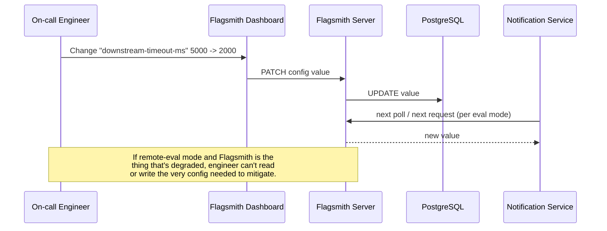

- **Complexity:** Low.
- **Dependencies:** Flagsmith Server/DB for the value to propagate.
- **Production impact if backend is unavailable:** Same eval-mode-dependent risk as Use Cases 1–2 — worth deciding local vs. remote evaluation deliberately before relying on this for incident response.

---

## GrowthBook

### Runtime & Dependency Architecture

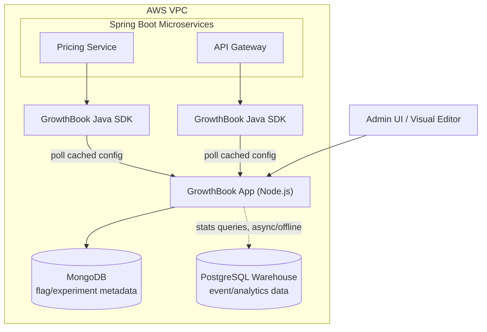

**Complexity:** Medium-High — adds MongoDB as a new database technology alongside your PostgreSQL, plus a warehouse integration if you want the stats engine.

---

### Use Case 1 — A/B test on checkout pricing display

Two variants of a pricing display are bucketed via consistent hashing in `pricing-service`; conversion events land in the PostgreSQL warehouse; GrowthBook's Bayesian stats engine computes significance and surfaces a winner.

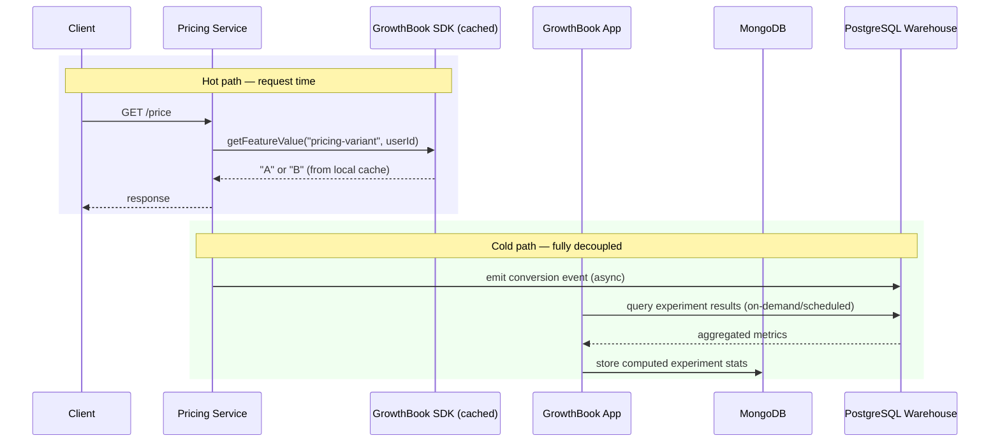

- **Complexity:** Medium-High — needs an event-tracking pipeline into the warehouse plus experiment/metric definitions.
- **Dependencies:** GrowthBook App, MongoDB (metadata), PostgreSQL warehouse (results), an event pipeline.
- **Production impact if backend is unavailable:** Low. Bucketing is resolved locally from cached SDK config; the entire stats computation is async and off the request path.

---

### Use Case 2 — Rollout gated by a guardrail metric

A new recommendation algorithm rolls out to 10% of traffic; GrowthBook monitors an "error rate" guardrail metric from the warehouse and surfaces an alert if a regression is detected (OSS tier alerts, not automatic rollback).

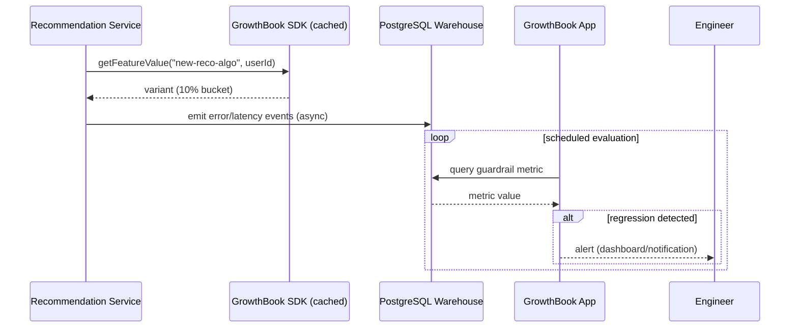

- **Complexity:** High — guardrail metric definitions, warehouse query correctness, alert wiring.
- **Dependencies:** warehouse connection, GrowthBook App, MongoDB, SDK.
- **Production impact if backend is unavailable:** Low for the hot path (same caching model as Use Case 1); the guardrail *detection* itself pauses, which is a monitoring gap, not a request-path failure.

---

### Use Case 3 — No-code visual experiment on a marketing landing page

The growth/marketing team uses GrowthBook's visual editor to test two hero-section variants on the public marketing site, without engineering involvement, via the client-side JS SDK.

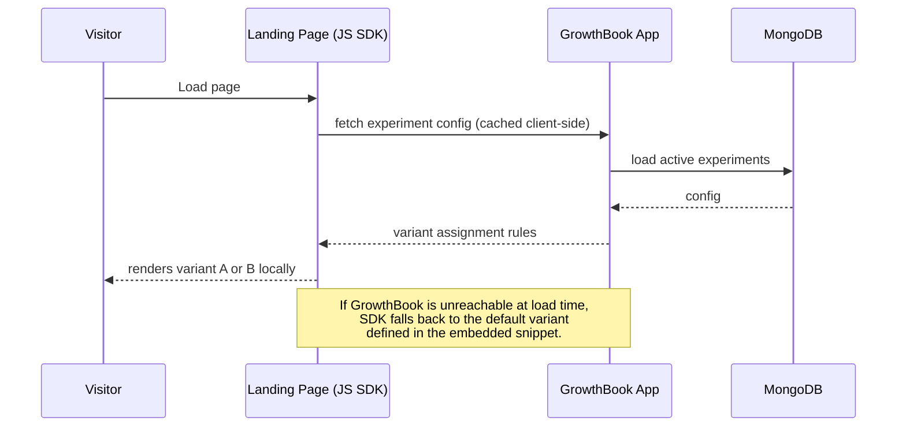

- **Complexity:** Low for the marketing team (no-code); requires a one-time front-end integration point.
- **Dependencies:** GrowthBook App, MongoDB. Your Java backend is not in this particular loop.
- **Production impact if backend is unavailable:** Low — isolated to front-end rendering, with a defined default-variant fallback.

---

## FF4J

### Runtime & Dependency Architecture

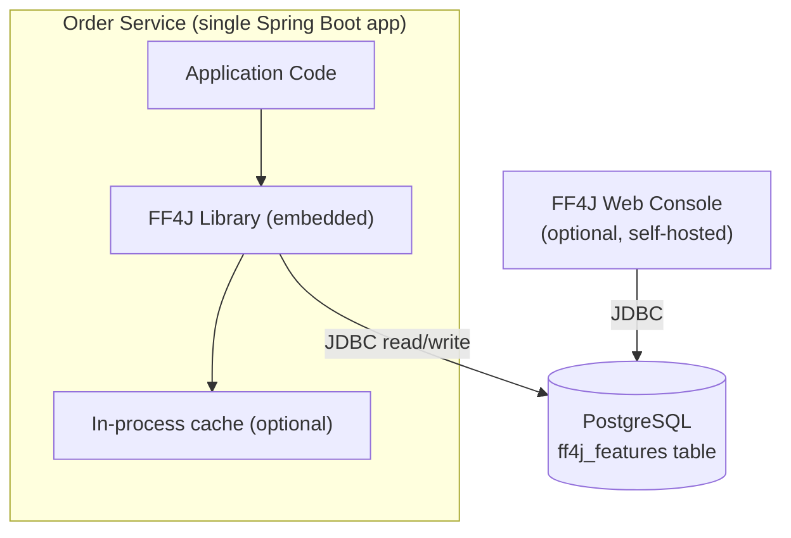

**Complexity:** Low per service — it's a library, not a server. Complexity shifts to the *fleet* level once more than one or two services share a flag store (see Use Case 3).

---

### Use Case 1 — Low-latency flags in a latency-sensitive pricing calculation

A single high-throughput pricing service needs flag checks with no network hop at all; FF4J is configured with an in-memory store so no external call happens during request handling.

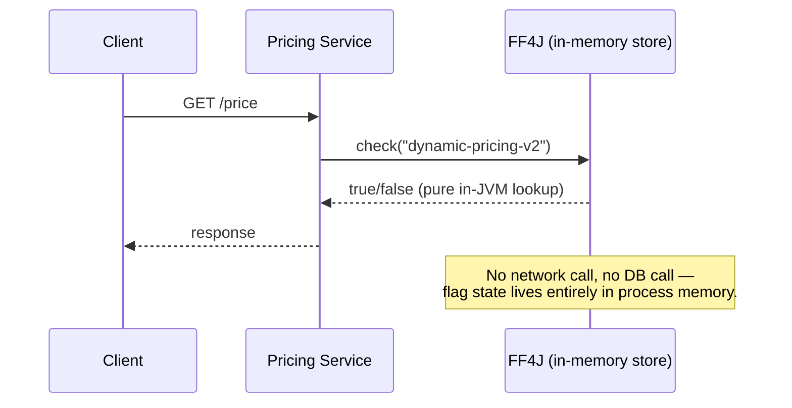

- **Complexity:** Low — single service, no cross-service sync needed.
- **Dependencies:** None beyond the JVM if using an in-memory store; JDBC/Postgres only if persistence across restarts is required.
- **Production impact if Postgres is unavailable:** None for reads (in-memory store); if instead configured to hit JDBC per check with no cache, uncached reads would throw and need explicit fallback handling — an anti-pattern worth avoiding.

---

### Use Case 2 — Scheduled/time-based feature activation

A promotional banner and pricing rule auto-activate at a specific timestamp using FF4J's time-based flip strategy, with no deploy or manual toggle needed at go-live.

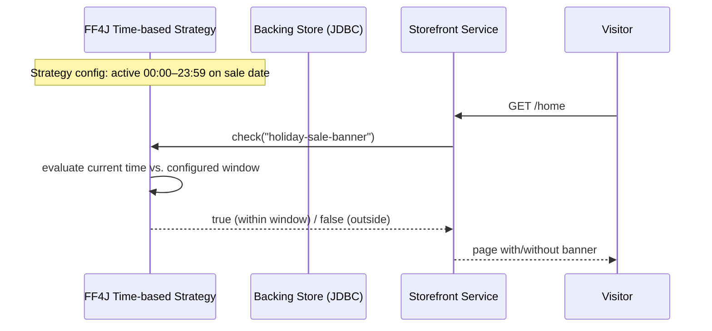

- **Complexity:** Low-Medium — strategy configuration and timezone handling need care.
- **Dependencies:** FF4J library, backing store for the scheduled config.
- **Production impact if backend is unavailable:** Minimal; strategy evaluation is local/in-process once the config is loaded.

---

### Use Case 3 — Shared Postgres-backed table across a small service cluster

Four or five internal services (inventory, warehouse, fulfillment, shipping) each embed FF4J pointed at one shared `ff4j_features` table, with a self-hosted FF4J console for manual toggling.

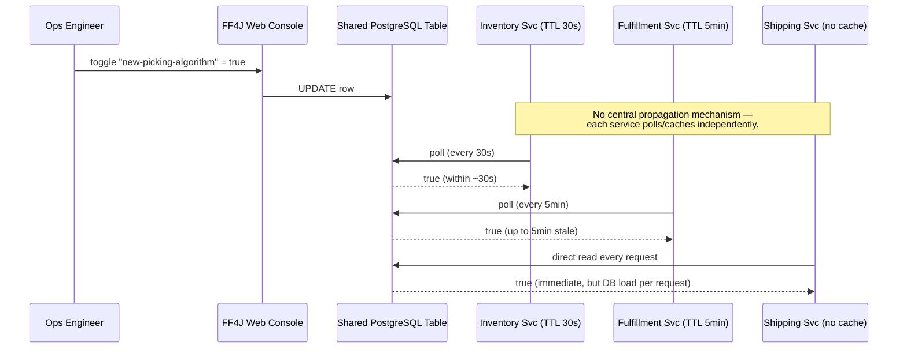

- **Complexity:** Medium — this is where the lack of a central server shows: every service owns its own cache/refresh policy, and there's no built-in propagation or streaming.
- **Dependencies:** shared PostgreSQL table, FF4J library per service, optional console deployment.
- **Production impact if Postgres is unavailable:** Inconsistent by design — depends entirely on each service's individual caching configuration. Services with no caching (like `Shipping` above) fail or block on every check; services with long TTLs keep serving stale-but-safe values. Standardizing cache policy across the fleet is a manual discipline, not something the tool enforces.

---

## GO Feature Flag (GOFF)

### Runtime & Dependency Architecture

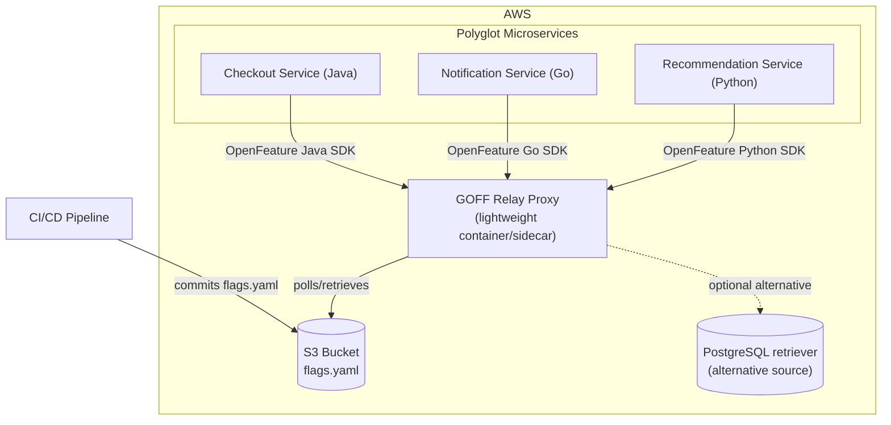

**Complexity:** Low — no mandatory database, a single lightweight binary/container, but no built-in admin UI for non-engineers.

---

### Use Case 1 — GitOps-managed flags-as-code via CI/CD

Flags are defined in a `flags.yaml` file committed to Git; CI/CD syncs it to S3 on merge; the relay proxy picks up changes automatically. Flag changes go through the same PR review as code.

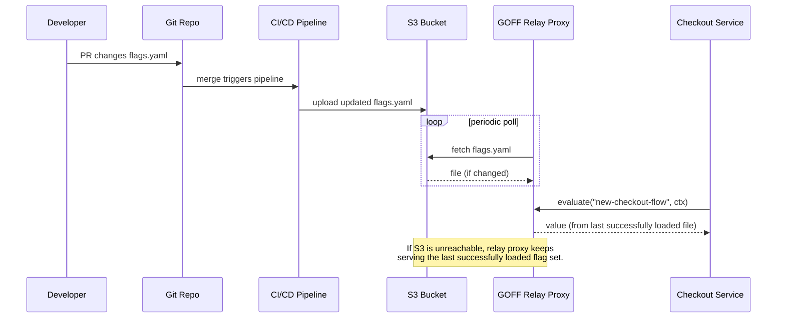

- **Complexity:** Low-Medium — requires CI/CD wiring; no admin UI means non-engineers can't self-serve toggles.
- **Dependencies:** S3 bucket, CI/CD pipeline, relay proxy.
- **Production impact if S3 is unavailable:** Low — in-memory fallback to last-loaded config; new changes simply can't land until connectivity is restored.

---

### Use Case 2 — Shared relay proxy for low-latency in-VPC evaluation across polyglot services

A shared ECS/EKS-hosted relay-proxy container serves flag evaluations to Java, Go, and Python services in the same cluster via OpenFeature (OFREP), avoiding a heavier platform purely to get one evaluation point across languages.

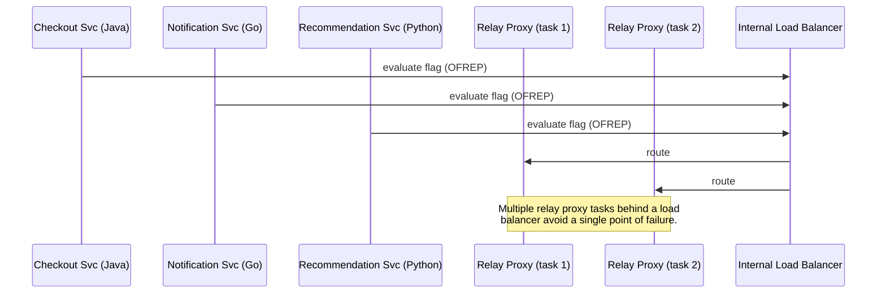

- **Complexity:** Low — single lightweight binary, no database required.
- **Dependencies:** relay proxy container(s), a retriever source (S3/Postgres/etc.), network path within the VPC.
- **Production impact if the relay proxy is down:** Medium if run as a single instance — unlike SDK-embedded local caching, services depend on the proxy being reachable at evaluation time. Mitigated by deploying multiple redundant proxy tasks, as shown above.

---

### Use Case 3 — PostgreSQL-retriever mode, reusing the existing RDS instance

Instead of S3, flags are stored in a dedicated table in the team's existing PostgreSQL/RDS instance that GOFF polls directly — "flags as data, queryable by SQL" rather than "flags as files."

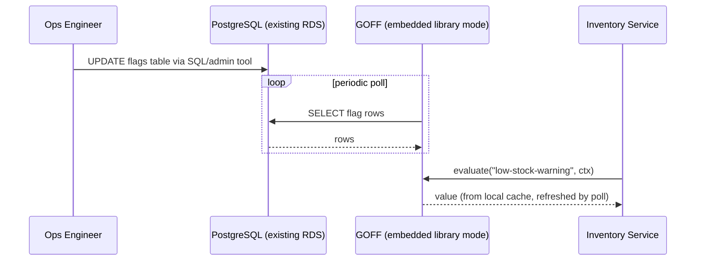

- **Complexity:** Low — reuses existing infrastructure, no new datastore technology.
- **Dependencies:** the PostgreSQL table, the GOFF binary (embedded or relay-proxy mode).
- **Production impact if Postgres is unavailable:** Low in embedded/library mode (in-memory cache refreshed periodically); Medium in relay-proxy mode without redundancy — same caveat as Use Case 2.

---

## In-House Facade (Alongside Unleash or GOFF)

Not a sixth tool — a thin custom layer wired in front of whichever engine won the standalone comparison (see `feature-flags-facade-sketch.md` for the API sketch). It inherits its host engine's runtime behavior entirely; what it adds is a typed API, auto-resolved context, centralized failure policy, and vendor-swap insurance.

### Runtime & Dependency Architecture

```mermaid
flowchart TB
    subgraph vpc["AWS VPC"]
        subgraph services["Spring Boot Microservices"]
            SVC1["Checkout Service"]
            SVC2["Billing Service"]
        end
        F1["FeatureFlags Facade"]
        F2["FeatureFlags Facade"]
        SPI["FlagEngine SPI"]
        ENGINE["UnleashFlagEngine OR GoffFlagEngine<br/>(config-selected adapter)"]
        BACKEND[("Unleash Server + PostgreSQL<br/>— or —<br/>GOFF Relay Proxy + S3/Postgres retriever")]
    end
    ENT[("Entitlements / Billing data<br/>(existing service)")]

    SVC1 --> F1
    SVC2 --> F2
    F1 --> SPI
    F2 --> SPI
    F1 -. "resolve tenant/plan traits" .-> ENT
    SPI --> ENGINE
    ENGINE --> BACKEND
```

**Complexity:** Same as whichever engine is selected (Low for GOFF, Medium for Unleash), plus one shared internal library every service takes a dependency on and one team that owns it.

---

### Use Case 1 — Tenant-aware targeting resolved from your own entitlements data

A rate-limit override should apply only to accounts on the Enterprise plan. Instead of re-declaring "Enterprise plan" as a segment inside the vendor UI, the facade resolves it from the entitlements service you already run.

```mermaid
sequenceDiagram
    participant Client
    participant Billing as Billing Service
    participant Facade as FeatureFlags Facade
    participant Ent as Entitlements Service (existing)
    participant Engine as FlagEngine (Unleash/GOFF)

    Client->>Billing: GET /usage-limits
    Billing->>Facade: isEnabled(RAISED_RATE_LIMIT)
    Facade->>Facade: FlagContext.current()
    Facade->>Ent: resolve tenant plan/traits
    Ent-->>Facade: plan = "enterprise"
    Facade->>Engine: evaluateBoolean(key, context)
    Engine-->>Facade: true/false (in-process, cached)
    Facade-->>Billing: result
    Billing-->>Client: 200 OK

    Note over Facade,Ent: Targeting trait resolved once from your<br/>own domain model — not duplicated as a<br/>vendor-side segment definition.
```

- **Complexity:** Low-Medium — wiring `FlagContext.current()` to the existing tenant/entitlements model.
- **Dependencies:** the underlying engine (Tier 1 performance either way) plus the entitlements service/data.
- **Production impact if the engine is unavailable:** identical to the host engine alone (negligible — cached, in-process). New dependency to design for: what the facade does if the *entitlements* lookup itself fails — this should have its own declared fallback trait, same discipline as the flag's own failure policy.

---

### Use Case 2 — Fleet-wide fail-open/fail-closed policy enforced consistently

A shipping-API kill switch needs identical failure behavior across every service that calls it — no team should be free to improvise whether it fails open or closed.

```mermaid
sequenceDiagram
    participant OnCall as On-call Engineer
    participant UI as Vendor Admin UI
    participant Engine as Unleash/GOFF backend
    participant FA as Facade (Order Svc)
    participant FB as Facade (Notification Svc)
    participant FC as Facade (Billing Svc)

    OnCall->>UI: toggle "shipping-api-kill-switch"
    UI->>Engine: update state
    par propagate
        Engine-->>FA: updated value (poll/stream)
        Engine-->>FB: updated value
        Engine-->>FC: updated value
    end
    Note over FA,FC: Every facade instance applies the SAME<br/>declared FailurePolicy for this flag — not<br/>whatever each team happened to code.

    Engine--xFB: simulated outage
    FB->>FB: catch exception, apply metadata().failurePolicy()
    Note over FB: Falls back to FAIL_OPEN automatically —<br/>identical to a healthy "false" response.
```

- **Complexity:** Low — this is a policy-consistency win, not new infrastructure.
- **Dependencies:** the engine, plus the `Feature` registry's declared `FailurePolicy` per flag (a governance artifact, not a runtime dependency).
- **Production impact if the engine is unavailable:** Bounded and predictable — every service reacts identically per the declared policy, closing the exact gap flagged in the FF4J and Flagsmith use cases above (inconsistent per-service handling).

---

### Use Case 3 — Swapping the underlying engine without touching call sites

GOFF was chosen for its light footprint, but six months in, the team decides Unleash's maturity is worth the heavier ops cost — or GOFF's project momentum stalls and they want an exit ramp.

```mermaid
sequenceDiagram
    participant Dev as Platform Engineer
    participant Cfg as Spring Config (flags.engine)
    participant Facade as FeatureFlags Facade
    participant SPI as FlagEngine SPI
    participant Old as GoffFlagEngine
    participant New as UnleashFlagEngine
    participant App as Checkout Service (unchanged)

    Note over App: App code only ever calls FeatureFlags —<br/>never imports Unleash or GOFF directly.

    Cfg->>SPI: flags.engine=goff (current)
    App->>Facade: isEnabled(NEW_CHECKOUT_FLOW)
    Facade->>SPI: evaluateBoolean(...)
    SPI->>Old: delegate
    Old-->>App: result (via Facade)

    Dev->>Cfg: flip flags.engine=unleash
    Cfg->>SPI: wire UnleashFlagEngine bean
    App->>Facade: isEnabled(NEW_CHECKOUT_FLOW)
    Facade->>SPI: evaluateBoolean(...)
    SPI->>New: delegate
    New-->>App: result (via Facade)

    Note over App: Zero code changes in Checkout Service<br/>across the entire engine migration.
```

- **Complexity:** Low for the migration itself (a config flip plus one adapter class); the Medium cost was paid up front building the facade that made this possible.
- **Dependencies:** both engines' SDKs available during the transition window; a deploy to flip config per service.
- **Production impact:** this use case *is* the mitigation for the vendor-risk row in the comparison doc (GOFF's smaller community, Unleash's heavier footprint) — the facade converts a potential rewrite into a config change.

---

## Cross-tool summary — production impact if the flag backend goes down

| Tool | Default failure mode | Mitigation | Fleet-level complexity |
|---|---|---|---|
| Unleash | SDK serves last cached config (poll-based, in-process) | None needed — caching is the default | Medium (server + Postgres to operate) |
| Flagsmith | **Remote-eval SDKs fail per-request by default** | Must explicitly enable local-evaluation mode | Medium (server + Postgres to operate) |
| GrowthBook | Bucketing SDK caches locally; stats engine is fully async/offline | None needed for the hot path | Medium-High (server + MongoDB + warehouse integration) |
| FF4J | Depends entirely on each service's own cache config — inconsistent by design across a fleet | Must standardize caching policy manually across every embedding service | Low per-service, rises at fleet scale (no central sync) |
| GO Feature Flag | Embedded/library mode caches like Unleash; relay-proxy mode depends on proxy availability | Deploy relay proxy with redundancy if that mode is used | Low (no mandatory database, single binary) |
| In-House Facade (alongside) | Identical to whichever engine it wraps — the facade adds no I/O of its own | Centralized `FailurePolicy` per flag, applied uniformly fleet-wide (see Use Case 2 above) | Same as the host engine, plus one shared internal library to own and version |

*This document is a discussion aid, not a final recommendation.*
